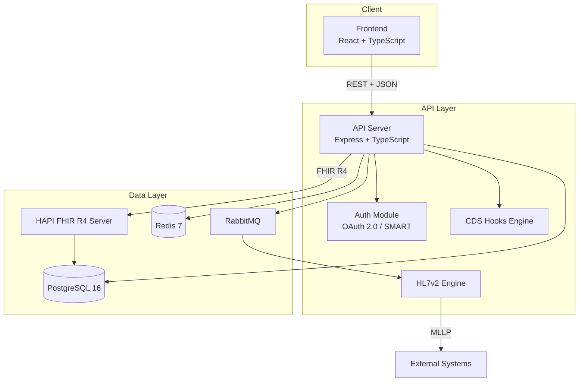

# Tribal EHR

**A production-grade Electronic Health Record system designed for ONC Health IT Certification (HTI-1)**

[]()
[]()
[]()
[]()
[]()
[]()

Tribal EHR is a full-featured, standards-compliant EHR platform built from the ground up to meet ONC Health IT Certification requirements under the 21st Century Cures Act. The system implements FHIR R4, US Core STU6, HL7v2, C-CDA, CDS Hooks, SMART on FHIR, and Bulk Data Access, providing a complete health IT solution for clinical workflows, interoperability, and population health.

---

## Quick Start

### Prerequisites

- **Docker** >= 24.0 and **Docker Compose** >= 2.20
- **Node.js** >= 20.0 (with npm >= 10.0)
- **Git**

### Launch the Full Stack

```bash
# Clone the repository
git clone https://github.com/your-org/tribal-ehr.git
cd tribal-ehr

# Copy and configure environment variables
cp .env.example .env

# Start all services (PostgreSQL, Redis, RabbitMQ, HAPI FHIR, API, Frontend)
docker-compose up -d

# Verify all services are healthy
docker-compose ps
```

Once started, the following services are available:

| Service       | URL                          | Description                    |
|---------------|------------------------------|--------------------------------|
| Frontend      | http://localhost:3000         | EHR user interface             |
| API Server    | http://localhost:3001         | REST + FHIR proxy API          |
| HAPI FHIR     | http://localhost:8080/fhir    | FHIR R4 server                 |
| RabbitMQ Mgmt | http://localhost:15672        | Message queue management UI    |

---

## Technology Stack

| Layer              | Technology                          | Version  | Purpose                                      |
|--------------------|-------------------------------------|----------|----------------------------------------------|
| Frontend           | React + TypeScript                  | 18.x     | Clinical user interface                      |
| Build Tool         | Vite                                | 5.x      | Frontend build and HMR                       |
| UI Components      | shadcn/ui + Tailwind CSS            | -        | Accessible, composable UI primitives         |
| State Management   | Zustand                             | 4.x      | Lightweight client-side state                |
| API Server         | Node.js + Express + TypeScript      | 20.x     | REST API, business logic, FHIR proxy         |
| FHIR Server        | HAPI FHIR JPA Server               | 6.x      | FHIR R4 resource storage and search          |
| Database           | PostgreSQL                          | 16       | Relational data storage                      |
| Cache              | Redis                               | 7        | Session management, caching                  |
| Message Queue      | RabbitMQ                            | 3.x      | Async messaging, HL7v2 routing               |
| Authentication     | OAuth 2.0 + SMART on FHIR          | -        | Standards-based auth and app launch          |
| MFA                | TOTP (RFC 6238)                     | -        | Multi-factor authentication                  |
| HL7 Messaging      | Custom HL7v2 Engine                 | 2.x      | ADT, ORM, ORU message processing             |
| CDS                | CDS Hooks                           | 1.1      | Clinical decision support                    |
| Containerization   | Docker + Docker Compose             | -        | Consistent deployment environments           |
| Testing            | Jest + Playwright                   | 29.x     | Unit, integration, and E2E testing           |
| Language           | TypeScript                          | 5.3      | Type-safe development across all packages    |

---

## Architecture Overview

Tribal EHR follows a modular monorepo architecture with clearly separated concerns across seven packages:



---

## Project Structure

```
tribal-ehr/
├── packages/
│   ├── frontend/          # React UI application (Vite + shadcn/ui)
│   │   └── src/
│   │       ├── components/    # Reusable UI and layout components
│   │       ├── pages/         # Route-based page components
│   │       ├── stores/        # Zustand state stores
│   │       └── lib/           # Utilities and API client
│   ├── api/               # Express REST API server
│   │   └── src/
│   │       ├── routes/        # Resource-based route handlers
│   │       ├── middleware/    # Auth, audit, validation, error handling
│   │       ├── db/            # Migrations, seeds, init scripts
│   │       ├── config/        # Server configuration
│   │       └── utils/         # Shared utilities
│   ├── fhir-server/       # HAPI FHIR server configuration
│   ├── hl7-engine/        # HL7v2 message parser, builder, router
│   │   └── src/
│   │       ├── parser/        # HL7v2 message parsing
│   │       ├── builder/       # HL7v2 message construction
│   │       ├── validator/     # Message validation rules
│   │       ├── router/        # Message routing logic
│   │       ├── transport/     # MLLP transport layer
│   │       └── messages/      # Message type definitions
│   ├── auth/              # Authentication and authorization
│   │   └── src/
│   │       ├── oauth/         # OAuth 2.0 + SMART on FHIR
│   │       ├── mfa/           # TOTP multi-factor authentication
│   │       ├── rbac/          # Role-based access control
│   │       ├── password/      # Password hashing and policies
│   │       └── session/       # Session management
│   ├── cds-hooks/         # Clinical Decision Support hooks
│   │   └── src/
│   │       ├── engine/        # CDS evaluation engine
│   │       ├── rules/         # Clinical rule definitions
│   │       └── types.ts       # CDS type definitions
│   └── shared/            # Shared types, constants, utilities
│       └── src/
│           ├── types/         # TypeScript interfaces and types
│           ├── constants/     # FHIR, terminology, role constants
│           └── utils/         # Validation, FHIR mapping utilities
├── tests/
│   ├── unit/              # Unit tests (Jest)
│   ├── integration/       # Integration tests (Jest)
│   └── e2e/               # End-to-end tests (Playwright)
├── config/
│   ├── fhir-profiles/     # FHIR profile definitions
│   └── terminology/       # Terminology and value set configuration
├── scripts/               # Build, seed, and certification scripts
├── docs/                  # Project documentation
├── docker-compose.yml     # Full-stack service orchestration
├── package.json           # Root workspace configuration
└── tsconfig.json          # Root TypeScript configuration
```

---

## Development Setup

### 1. Clone and Install Dependencies

```bash
git clone https://github.com/your-org/tribal-ehr.git
cd tribal-ehr
npm install
```

### 2. Start Infrastructure Services

```bash
# Start PostgreSQL, Redis, RabbitMQ, and HAPI FHIR
docker-compose up -d postgres redis rabbitmq hapi-fhir

# Wait for HAPI FHIR to become healthy (can take 1-2 minutes on first start)
docker-compose logs -f hapi-fhir
```

### 3. Run Database Migrations

```bash
npm run db:migrate
```

### 4. Seed Development Data (Optional)

```bash
npm run db:seed
```

### 5. Start Development Servers

```bash
# Start API and Frontend with hot reload
npm run dev
```

This uses `concurrently` to run both the API server (port 3001) and the Vite dev server (port 3000) with hot module replacement.

### 6. Verify Setup

- Open http://localhost:3000 for the frontend
- Open http://localhost:3001/health for the API health check
- Open http://localhost:8080/fhir/metadata for the FHIR CapabilityStatement

---

## Testing

### Unit Tests

```bash
npm run test:unit
```

Runs all unit tests under `tests/unit/` using Jest with ts-jest.

### Integration Tests

```bash
npm run test:integration
```

Requires infrastructure services running. Tests API routes, database operations, and FHIR server interactions.

### End-to-End Tests

```bash
npm run test:e2e
```

Runs Playwright browser-based tests covering clinical workflows. Requires all services running.

### Full Test Suite

```bash
npm test
```

Runs all workspace tests in sequence.

### Certification Tests

```bash
npm run cert:test
```

Runs the ONC certification test suite using the script at `scripts/run-certification-tests.sh`.

---

## ONC Certification Status

Tribal EHR targets compliance with the ONC Health IT Certification Program under the HTI-1 Final Rule. The following certification criteria are addressed:

| Category                 | Criteria Covered                                             | Status        |
|--------------------------|--------------------------------------------------------------|---------------|
| CPOE                     | (a)(1) Medications, (a)(2) Lab, (a)(3) Imaging               | In Progress   |
| Clinical                 | (a)(5) Demographics, (a)(9) CDS, (a)(14) Implantable Devices | In Progress   |
| Care Coordination        | (b)(1)(b)(2) C-CDA, (b)(3) e-Prescribing                     | In Progress   |
| Clinical Quality         | (c)(1)(c)(2)(c)(3) CQM Record/Import/Report                  | In Progress   |
| Privacy & Security       | (d)(1)-(d)(13) Auth, Audit, Encryption, MFA                  | In Progress   |
| Public Health            | (f)(1)(f)(2)(f)(5) Immunization, Syndromic, eCR               | In Progress   |
| Design & Performance     | (g)(4)-(g)(10) QMS, Accessibility, API Access                 | In Progress   |
| Direct Messaging         | (h)(1)(h)(2) Direct Send/Receive                              | In Progress   |

For the full criterion-by-criterion mapping, see [docs/ONC_CERTIFICATION_MAP.md](docs/ONC_CERTIFICATION_MAP.md).

---

## HIPAA Compliance

Tribal EHR incorporates HIPAA compliance measures across the entire stack:

- **Access Controls**: Role-based access control (RBAC) with principle of least privilege, enforced at the API middleware layer
- **Audit Trails**: Every access to protected health information (PHI) is logged in a tamper-resistant, hash-chained audit log (see `packages/api/src/middleware/audit.ts`)
- **Encryption in Transit**: All communications secured via TLS 1.2+ with strong cipher suites
- **Encryption at Rest**: PHI encrypted using AES-256-GCM; database-level transparent data encryption (TDE) for PostgreSQL
- **Authentication**: Multi-factor authentication (TOTP) required for all clinical users
- **Session Management**: Automatic session timeout after 15 minutes of inactivity
- **Minimum Necessary**: API responses scoped to the minimum data required for each role
- **Backup and Recovery**: Automated encrypted backups with tested recovery procedures
- **Business Associate Agreements**: Infrastructure and third-party service BAA tracking

---

## Contributing

1. Fork the repository
2. Create a feature branch from `main` (`git checkout -b feature/your-feature`)
3. Write tests for any new functionality
4. Ensure all tests pass (`npm test`)
5. Ensure code passes linting (`npm run lint`)
6. Submit a pull request with a clear description of changes

All contributions must maintain HIPAA compliance and must not introduce security vulnerabilities. PHI must never appear in test fixtures, logs, or version control.

---

## License

Copyright 2024-2026 Tribal EHR Contributors

Licensed under the Apache License, Version 2.0 (the "License"); you may not use this project except in compliance with the License. You may obtain a copy of the License at:

http://www.apache.org/licenses/LICENSE-2.0

Unless required by applicable law or agreed to in writing, software distributed under the License is distributed on an "AS IS" BASIS, WITHOUT WARRANTIES OR CONDITIONS OF ANY KIND, either express or implied. See the License for the specific language governing permissions and limitations under the License.

---

## Documentation

- [Architecture](docs/ARCHITECTURE.md)
- [ONC Certification Map](docs/ONC_CERTIFICATION_MAP.md)
- [FHIR Conformance](docs/FHIR_CONFORMANCE.md)
- [Deployment Guide](docs/DEPLOYMENT_GUIDE.md)
- [API Reference](docs/API_REFERENCE.md)
