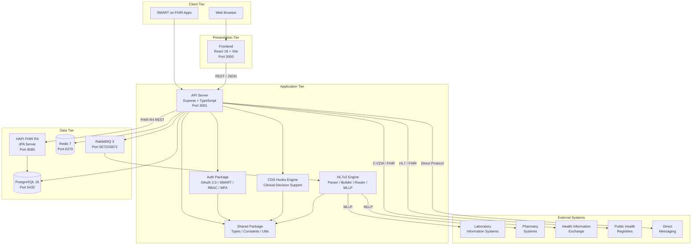
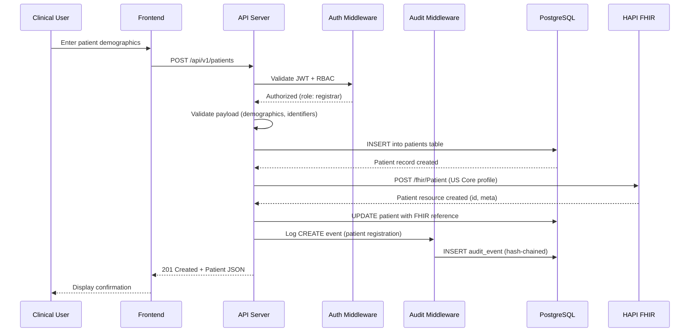
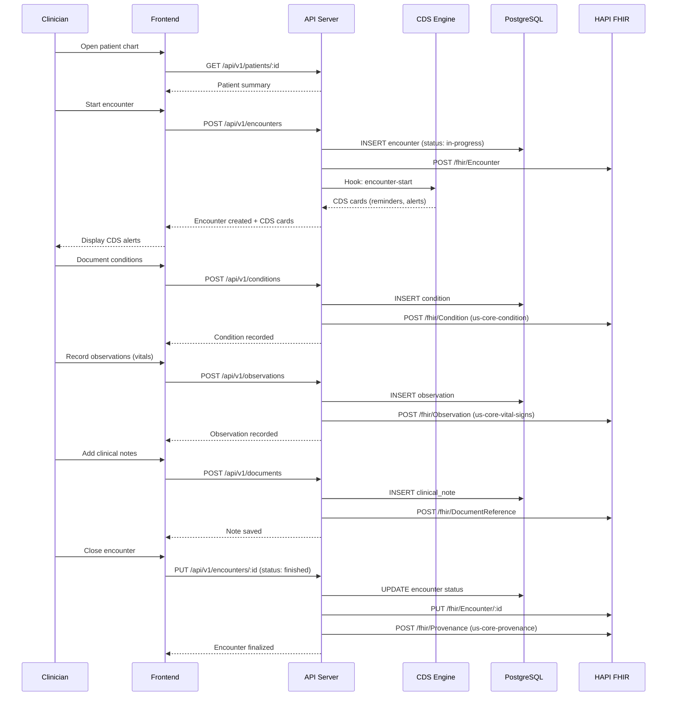
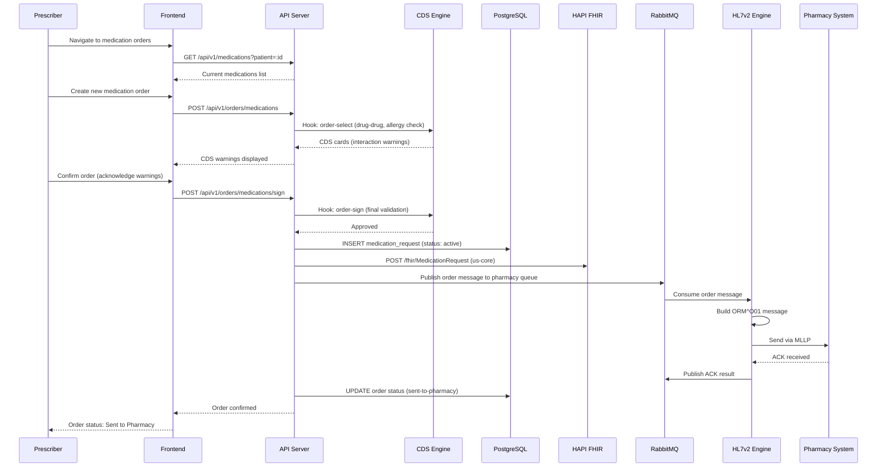
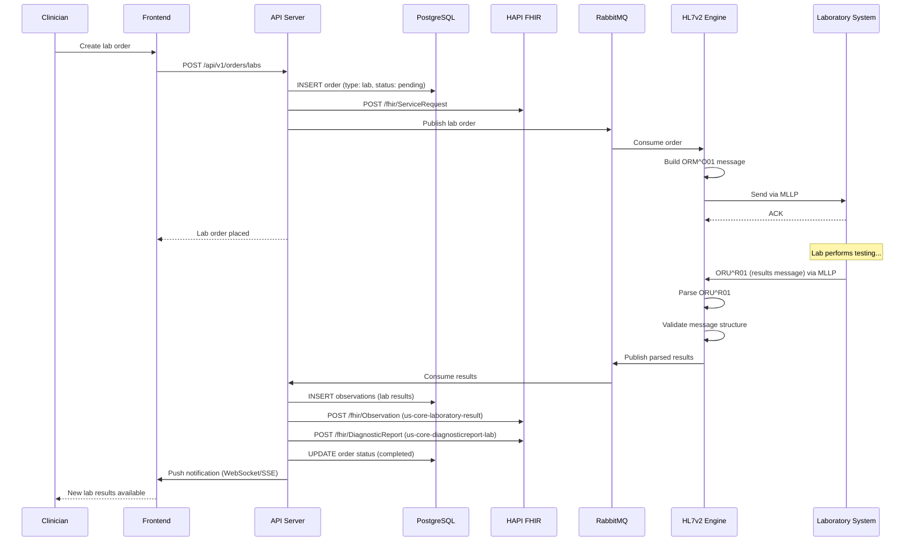
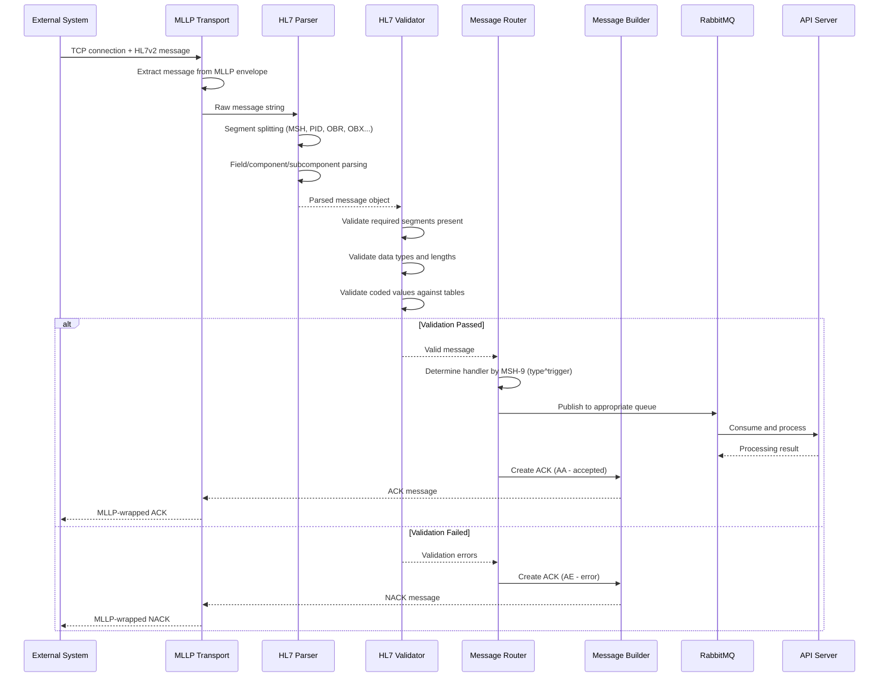
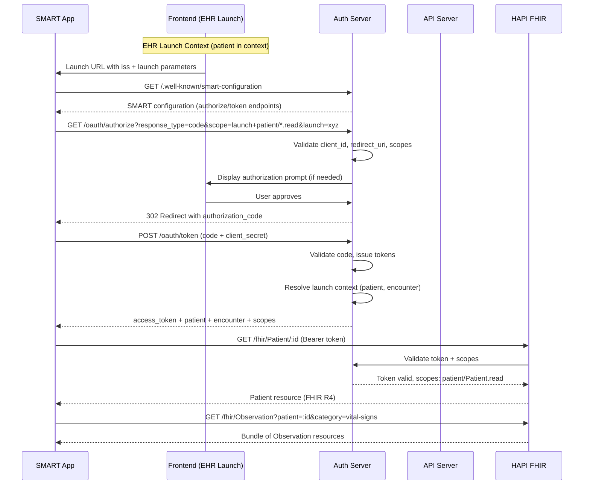
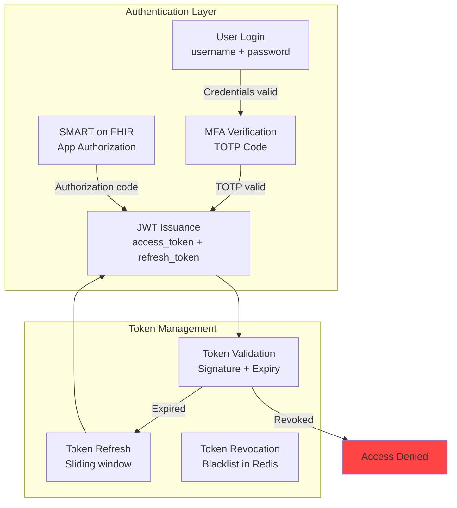
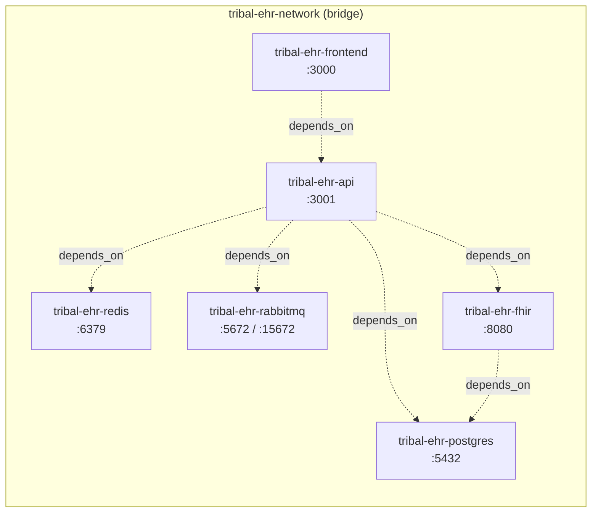

# Tribal EHR -- Architecture Document

**Version:** 1.0
**Last Updated:** 2026-02-05
**Status:** Living Document

---

## Table of Contents

1. [System Overview](#system-overview)
2. [Component Descriptions](#component-descriptions)
3. [Data Flow Diagrams](#data-flow-diagrams)
4. [Database Schema Overview](#database-schema-overview)
5. [Security Architecture](#security-architecture)
6. [Integration Architecture](#integration-architecture)
7. [Infrastructure](#infrastructure)
8. [Technology Decisions](#technology-decisions)
9. [Performance Considerations](#performance-considerations)

---

## 1. System Overview

Tribal EHR is a modular, monorepo-based EHR platform composed of seven packages, four infrastructure services, and a comprehensive test suite. The architecture prioritizes standards compliance (FHIR R4, US Core STU6, HL7v2, C-CDA), security (HIPAA, ONC certification), and operational resilience.

### High-Level Architecture Diagram



### Design Principles

1. **Standards First**: Every data exchange uses an ONC-recognized standard (FHIR R4, HL7v2, C-CDA, Direct)
2. **Security by Default**: Authentication, authorization, encryption, and audit logging are built into every layer
3. **Separation of Concerns**: Each package has a single responsibility and communicates through well-defined interfaces
4. **Testability**: Every component is independently testable with clear dependency injection boundaries
5. **Regulatory Traceability**: Every ONC certification criterion maps to specific code paths, tests, and documentation

---

## 2. Component Descriptions

### 2.1 Frontend (`packages/frontend`)

| Attribute       | Value                                              |
|-----------------|----------------------------------------------------|
| Framework       | React 18 with TypeScript                           |
| Build Tool      | Vite 5                                             |
| UI Library      | shadcn/ui (Radix UI primitives + Tailwind CSS)     |
| State           | Zustand                                            |
| Routing         | React Router                                       |
| Port            | 3000                                               |

**Responsibilities:**
- Render clinical workflows: patient registration, encounter documentation, order entry (CPOE), results review, scheduling, messaging
- Enforce accessibility standards (WCAG 2.1 AA) per ONC criterion (g)(5)
- Manage client-side session state and automatic timeout (15-minute inactivity)
- Provide responsive layout via `MainLayout.tsx`, `Header.tsx`, and `Sidebar.tsx`

**Key Directories:**
- `src/pages/` -- Route-based pages: `patients/`, `orders/`, `results/`, `scheduling/`, `messages/`, `admin/`
- `src/components/ui/` -- Reusable UI primitives (button, input, table, dialog, etc.)
- `src/components/layout/` -- Application shell and navigation
- `src/stores/` -- Zustand state stores for cross-component state
- `src/lib/` -- API client, utility functions

### 2.2 API Server (`packages/api`)

| Attribute       | Value                                              |
|-----------------|----------------------------------------------------|
| Runtime         | Node.js 20                                         |
| Framework       | Express                                            |
| Language        | TypeScript 5.3                                     |
| Port            | 3001                                               |
| ORM / Query     | Raw SQL with parameterized queries via `pg`        |

**Responsibilities:**
- Serve the REST API for all clinical and administrative operations
- Proxy and transform requests to the HAPI FHIR server (`routes/fhir-proxy.ts`)
- Enforce authentication and authorization via middleware (`middleware/auth.ts`)
- Generate tamper-resistant audit log entries (`middleware/audit.ts`)
- Validate all request payloads (`middleware/validation.ts`)
- Handle errors uniformly with FHIR-compatible OperationOutcome responses (`middleware/error-handler.ts`)
- Manage database migrations and seeding (`db/migrations/`, `db/seeds/`)

**Key Route Modules:**
- `routes/patients.ts` -- Patient demographics CRUD
- `routes/encounters.ts` -- Clinical encounter management
- `routes/orders.ts` -- CPOE (medications, labs, imaging)
- `routes/medications.ts` -- Medication management
- `routes/observations.ts` -- Vital signs, lab results, assessments
- `routes/conditions.ts` -- Problem list and encounter diagnoses
- `routes/allergies.ts` -- Allergy and intolerance tracking
- `routes/procedures.ts` -- Procedure documentation
- `routes/immunizations.ts` -- Immunization records
- `routes/care-plans.ts` -- Care plan management
- `routes/care-teams.ts` -- Care team composition
- `routes/goals.ts` -- Patient goal tracking
- `routes/documents.ts` -- C-CDA and document reference management
- `routes/devices.ts` -- Implantable device list
- `routes/scheduling.ts` -- Appointment scheduling
- `routes/audit.ts` -- Audit log query and reporting
- `routes/auth.ts` -- OAuth 2.0 token endpoints
- `routes/admin.ts` -- Administrative functions
- `routes/fhir-proxy.ts` -- FHIR R4 resource proxy to HAPI FHIR

### 2.3 FHIR Server (`packages/fhir-server`)

| Attribute       | Value                                              |
|-----------------|----------------------------------------------------|
| Implementation  | HAPI FHIR JPA Server                              |
| FHIR Version    | R4 (4.0.1)                                         |
| Profile         | US Core STU6 (6.1.0)                               |
| Port            | 8080                                               |
| Database        | PostgreSQL 16 (shared instance)                    |

**Responsibilities:**
- Store and serve FHIR R4 resources with full search capabilities
- Validate resources against US Core STU6 profiles
- Support Bulk Data Export ($export) for population-level queries
- Expose the FHIR CapabilityStatement at `/fhir/metadata`
- Provide terminology operations ($expand, $lookup, $translate)

**Configuration:** `packages/fhir-server/application.yaml`

### 2.4 HL7v2 Engine (`packages/hl7-engine`)

| Attribute       | Value                                              |
|-----------------|----------------------------------------------------|
| Protocol        | HL7 v2.x (2.3, 2.5.1)                             |
| Transport       | MLLP (Minimum Lower Layer Protocol)               |
| Language        | TypeScript                                         |

**Responsibilities:**
- Parse inbound HL7v2 messages into structured objects (`parser/hl7-parser.ts`)
- Build outbound HL7v2 messages with correct data types (`builder/data-types.ts`)
- Route messages to appropriate handlers based on message type and trigger event (`router/`)
- Validate message structure and required segments (`validator/`)
- Manage MLLP TCP connections for reliable message transport (`transport/`)

**Supported Message Types:**
- ADT (Admit/Discharge/Transfer): A01, A02, A03, A04, A08
- ORM (Order Messages): O01
- ORU (Observation Results): R01
- VXU (Immunization Updates): V04
- ACK (Acknowledgments)

### 2.5 Auth Package (`packages/auth`)

| Attribute       | Value                                              |
|-----------------|----------------------------------------------------|
| Protocol        | OAuth 2.0 + SMART on FHIR                         |
| MFA             | TOTP (RFC 6238)                                    |
| Sessions        | Redis-backed with configurable timeout             |

**Responsibilities:**
- Implement OAuth 2.0 authorization server (`oauth/authorization-server.ts`)
- Validate SMART on FHIR scopes and launch context (`oauth/scope-validator.ts`)
- Publish SMART configuration discovery document (`oauth/smart-configuration.ts`)
- Enforce role-based access control policies (`rbac/`)
- Manage TOTP-based multi-factor authentication (`mfa/totp.ts`)
- Handle password hashing, policies, and rotation (`password/`)
- Manage session lifecycle with Redis (`session/`)

### 2.6 CDS Hooks Engine (`packages/cds-hooks`)

| Attribute       | Value                                              |
|-----------------|----------------------------------------------------|
| Specification   | CDS Hooks 1.1                                      |
| Language        | TypeScript                                         |

**Responsibilities:**
- Evaluate clinical decision support rules against patient context (`engine/cds-engine.ts`)
- Maintain a library of clinical rules (`rules/preventive-care.ts` and extensions)
- Return CDS Hooks cards with suggestions, warnings, and information
- Support hook types: `patient-view`, `order-select`, `order-sign`, `encounter-start`

**Type Definitions:** `src/types.ts`

### 2.7 Shared Package (`packages/shared`)

| Attribute       | Value                                              |
|-----------------|----------------------------------------------------|
| Purpose         | Cross-package types, constants, and utilities       |

**Responsibilities:**
- Define TypeScript interfaces for all clinical and system entities (`types/`)
- Maintain FHIR resource type definitions (`types/fhir.ts`)
- Provide patient, auth, audit, and clinical type definitions
- Define constants for FHIR resources, terminology systems, and role definitions (`constants/`)
- Provide validation utilities (`utils/validation.ts`)
- Provide FHIR-to-internal data mapping (`utils/fhir-mapper.ts`)

---

## 3. Data Flow Diagrams

### 3.1 Patient Registration Flow



### 3.2 Clinical Encounter Documentation Flow



### 3.3 Medication Ordering (CPOE) Flow



### 3.4 Lab Order to Results Flow



### 3.5 HL7v2 Message Processing Flow



### 3.6 SMART on FHIR App Launch Flow



---

## 4. Database Schema Overview

### Entity Relationship Diagram

```mermaid
erDiagram
    USERS {
        uuid id PK
        varchar email UK
        varchar password_hash
        varchar role
        boolean mfa_enabled
        varchar totp_secret
        timestamp created_at
        timestamp updated_at
        timestamp last_login
    }

    PATIENTS {
        uuid id PK
        varchar fhir_id FK
        varchar mrn UK
        varchar first_name
        varchar last_name
        date date_of_birth
        varchar gender
        varchar race
        varchar ethnicity
        varchar preferred_language
        jsonb address
        jsonb telecom
        varchar ssn_encrypted
        boolean active
        timestamp created_at
        timestamp updated_at
    }

    ENCOUNTERS {
        uuid id PK
        varchar fhir_id FK
        uuid patient_id FK
        uuid practitioner_id FK
        varchar status
        varchar class_code
        varchar type_code
        timestamp period_start
        timestamp period_end
        text reason
        jsonb diagnoses
        timestamp created_at
    }

    CONDITIONS {
        uuid id PK
        varchar fhir_id FK
        uuid patient_id FK
        uuid encounter_id FK
        varchar clinical_status
        varchar verification_status
        varchar category
        jsonb code
        date onset_date
        date abatement_date
        timestamp recorded_date
    }

    OBSERVATIONS {
        uuid id PK
        varchar fhir_id FK
        uuid patient_id FK
        uuid encounter_id FK
        varchar status
        varchar category
        jsonb code
        jsonb value
        varchar unit
        timestamp effective_date
        jsonb reference_range
        varchar interpretation
    }

    ALLERGY_INTOLERANCES {
        uuid id PK
        varchar fhir_id FK
        uuid patient_id FK
        varchar clinical_status
        varchar type
        varchar category
        varchar criticality
        jsonb code
        jsonb reactions
        timestamp onset_date
        timestamp recorded_date
    }

    MEDICATION_REQUESTS {
        uuid id PK
        varchar fhir_id FK
        uuid patient_id FK
        uuid encounter_id FK
        uuid requester_id FK
        varchar status
        varchar intent
        jsonb medication
        jsonb dosage_instruction
        varchar dispense_quantity
        integer refills
        timestamp authored_on
    }

    PROCEDURES {
        uuid id PK
        varchar fhir_id FK
        uuid patient_id FK
        uuid encounter_id FK
        varchar status
        jsonb code
        timestamp performed_date
        uuid performer_id FK
        text note
    }

    IMMUNIZATIONS {
        uuid id PK
        varchar fhir_id FK
        uuid patient_id FK
        varchar status
        jsonb vaccine_code
        timestamp occurrence_date
        varchar lot_number
        date expiration_date
        jsonb site
        jsonb route
    }

    CARE_PLANS {
        uuid id PK
        varchar fhir_id FK
        uuid patient_id FK
        varchar status
        varchar intent
        varchar title
        text description
        date period_start
        date period_end
        jsonb activities
    }

    CARE_TEAMS {
        uuid id PK
        varchar fhir_id FK
        uuid patient_id FK
        varchar status
        varchar name
        jsonb participants
    }

    GOALS {
        uuid id PK
        varchar fhir_id FK
        uuid patient_id FK
        varchar lifecycle_status
        varchar achievement_status
        jsonb description
        date start_date
        date target_date
    }

    DOCUMENTS {
        uuid id PK
        varchar fhir_id FK
        uuid patient_id FK
        uuid encounter_id FK
        varchar type
        varchar status
        varchar content_type
        text content
        varchar format
        timestamp date_created
    }

    DEVICES {
        uuid id PK
        varchar fhir_id FK
        uuid patient_id FK
        varchar udi
        varchar device_name
        varchar type
        varchar manufacturer
        date manufacture_date
        date expiration_date
        varchar lot_number
        varchar serial_number
        varchar status
    }

    ORDERS {
        uuid id PK
        uuid patient_id FK
        uuid encounter_id FK
        uuid requester_id FK
        varchar order_type
        varchar status
        jsonb details
        varchar priority
        timestamp ordered_at
        timestamp completed_at
    }

    SCHEDULING {
        uuid id PK
        uuid patient_id FK
        uuid practitioner_id FK
        varchar status
        varchar appointment_type
        timestamp start_time
        timestamp end_time
        text reason
        text note
    }

    AUDIT_EVENTS {
        uuid id PK
        varchar event_type
        varchar action
        uuid user_id FK
        varchar user_role
        uuid patient_id FK
        varchar resource_type
        varchar resource_id
        jsonb detail
        varchar outcome
        timestamp recorded
        varchar previous_hash
        varchar event_hash
    }

    PROVENANCE {
        uuid id PK
        varchar fhir_id FK
        varchar target_resource_type
        varchar target_resource_id
        timestamp recorded
        uuid agent_id FK
        varchar agent_role
        varchar activity
    }

    CONSENTS {
        uuid id PK
        uuid patient_id FK
        varchar status
        varchar scope
        varchar category
        date period_start
        date period_end
        jsonb provision
        timestamp date_recorded
    }

    MESSAGES {
        uuid id PK
        uuid sender_id FK
        uuid recipient_id FK
        uuid patient_id FK
        varchar subject
        text body
        varchar status
        boolean is_read
        timestamp sent_at
    }

    CLINICAL_NOTES {
        uuid id PK
        uuid patient_id FK
        uuid encounter_id FK
        uuid author_id FK
        varchar note_type
        text content
        varchar status
        timestamp authored_on
        timestamp signed_at
    }

    OAUTH_CLIENTS {
        uuid id PK
        varchar client_id UK
        varchar client_secret_hash
        varchar client_name
        jsonb redirect_uris
        jsonb grant_types
        jsonb scopes
        varchar launch_type
        boolean active
    }

    USERS ||--o{ ENCOUNTERS : "practitioner"
    USERS ||--o{ MEDICATION_REQUESTS : "requester"
    USERS ||--o{ ORDERS : "requester"
    USERS ||--o{ AUDIT_EVENTS : "actor"
    USERS ||--o{ MESSAGES : "sender/recipient"
    USERS ||--o{ CLINICAL_NOTES : "author"
    PATIENTS ||--o{ ENCOUNTERS : "has"
    PATIENTS ||--o{ CONDITIONS : "has"
    PATIENTS ||--o{ OBSERVATIONS : "has"
    PATIENTS ||--o{ ALLERGY_INTOLERANCES : "has"
    PATIENTS ||--o{ MEDICATION_REQUESTS : "has"
    PATIENTS ||--o{ PROCEDURES : "has"
    PATIENTS ||--o{ IMMUNIZATIONS : "has"
    PATIENTS ||--o{ CARE_PLANS : "has"
    PATIENTS ||--o{ CARE_TEAMS : "has"
    PATIENTS ||--o{ GOALS : "has"
    PATIENTS ||--o{ DOCUMENTS : "has"
    PATIENTS ||--o{ DEVICES : "has"
    PATIENTS ||--o{ ORDERS : "has"
    PATIENTS ||--o{ SCHEDULING : "has"
    PATIENTS ||--o{ CONSENTS : "has"
    ENCOUNTERS ||--o{ CONDITIONS : "context"
    ENCOUNTERS ||--o{ OBSERVATIONS : "context"
    ENCOUNTERS ||--o{ MEDICATION_REQUESTS : "context"
    ENCOUNTERS ||--o{ PROCEDURES : "context"
    ENCOUNTERS ||--o{ DOCUMENTS : "context"
    ENCOUNTERS ||--o{ CLINICAL_NOTES : "context"
```



### Migration Strategy

Database migrations are managed sequentially via TypeScript files in `packages/api/src/db/migrations/`. Each migration is numbered and idempotent:

| Migration | Table                   | Purpose                                     |
|-----------|-------------------------|---------------------------------------------|
| 001       | extensions              | Enable uuid-ossp, pgcrypto extensions       |
| 002       | users                   | User accounts with roles and MFA            |
| 003       | patients                | Patient demographics and identifiers        |
| 004       | encounters              | Clinical encounters                         |
| 005       | conditions              | Diagnoses and problem list entries          |
| 006       | observations            | Vital signs, lab results, assessments       |
| 007       | allergy_intolerances    | Allergies and adverse reactions             |
| 008       | medication_requests     | Medication orders and prescriptions         |
| 009       | procedures              | Clinical procedures                         |
| 010       | immunizations           | Vaccination records                         |
| 011       | care_plans              | Treatment and care plans                    |
| 012       | care_teams              | Care team membership                        |
| 013       | goals                   | Patient health goals                        |
| 014       | documents               | C-CDA and clinical documents               |
| 015       | devices                 | Implantable device records                  |
| 016       | orders                  | CPOE order management                       |
| 017       | scheduling              | Appointment scheduling                      |
| 018       | audit_events            | Tamper-resistant audit log                  |
| 019       | provenance              | Resource change tracking                    |
| 020       | consents                | Patient consent management                  |
| 021       | messages                | Secure clinical messaging                   |
| 022       | clinical_notes          | Progress notes and documentation            |
| 023       | oauth_clients           | SMART on FHIR app registrations            |

---

## 5. Security Architecture

### 5.1 Authentication Flow (OAuth 2.0 + SMART on FHIR)



**Implementation Details:**
- **Password hashing**: bcrypt with cost factor 12 (`packages/auth/src/password/`)
- **JWT tokens**: RS256 signed, 15-minute access token TTL, 7-day refresh token TTL
- **MFA**: TOTP per RFC 6238, 30-second window, SHA-1 (`packages/auth/src/mfa/totp.ts`)
- **Session storage**: Redis with automatic expiration (`packages/auth/src/session/`)
- **OAuth 2.0 flows**: Authorization Code with PKCE for SMART apps (`packages/auth/src/oauth/authorization-server.ts`)
- **SMART discovery**: `/.well-known/smart-configuration` endpoint (`packages/auth/src/oauth/smart-configuration.ts`)

### 5.2 Authorization Model (RBAC)

Role-based access control is enforced at the API middleware layer (`packages/api/src/middleware/auth.ts`):

| Role             | Permissions                                                                   |
|------------------|-------------------------------------------------------------------------------|
| `physician`      | Full read/write on clinical data, order signing, encounter management         |
| `nurse`          | Read/write clinical data, vital signs, medication administration              |
| `registrar`      | Patient registration, demographics, scheduling                               |
| `lab_tech`       | Read orders, write lab results and observations                               |
| `pharmacist`     | Read/write medications, verify orders, drug interaction review                |
| `admin`          | User management, system configuration, audit report access                    |
| `patient`        | Read own clinical data (via patient portal / SMART app)                       |

Scope enforcement for SMART on FHIR apps is handled by `packages/auth/src/oauth/scope-validator.ts`, supporting scopes such as `patient/Patient.read`, `user/Observation.write`, `launch`, and `openid`.

### 5.3 Encryption Strategy

| Layer           | Method              | Details                                              |
|-----------------|---------------------|------------------------------------------------------|
| In Transit      | TLS 1.2+            | All HTTP traffic encrypted; HSTS enforced            |
| At Rest (DB)    | AES-256-GCM         | Sensitive fields (SSN, notes) encrypted at app layer |
| At Rest (Disk)  | LUKS / dm-crypt     | Full disk encryption on server volumes               |
| Credentials     | bcrypt (cost 12)    | Password hashing; never stored in plaintext          |
| API Keys        | SHA-256             | Client secrets hashed before storage                 |
| Backup          | AES-256-CBC         | Encrypted database backups with key rotation         |

The encryption key is configured via the `ENCRYPTION_KEY` environment variable (256-bit hex-encoded key).

### 5.4 Audit Trail Design (Hash-Chained Immutable Log)

Every access to or modification of PHI generates an audit event recorded in the `audit_events` table:

```
AuditEvent[n].event_hash = SHA-256(
    AuditEvent[n].event_type +
    AuditEvent[n].action +
    AuditEvent[n].user_id +
    AuditEvent[n].resource_type +
    AuditEvent[n].resource_id +
    AuditEvent[n].recorded +
    AuditEvent[n-1].event_hash   // previous hash in chain
)
```

**Properties:**
- **Immutability**: Hash chain makes retroactive modification detectable
- **Tamper resistance**: Any modification breaks the chain, which is verified on audit report generation
- **Completeness**: Middleware captures all CRUD operations on clinical resources
- **Non-repudiation**: Each event records the authenticated user ID and role
- **Implementation**: `packages/api/src/middleware/audit.ts` and `packages/api/src/routes/audit.ts`

**Audited Actions:**
- Patient record access (read)
- Clinical data creation, modification, deletion
- User authentication events (login, logout, MFA challenges)
- Order creation and signing
- Document export and print events
- Administrative actions (user management, configuration changes)

---

## 6. Integration Architecture

### 6.1 FHIR R4 API Layer

The API server proxies FHIR requests to the HAPI FHIR server via `packages/api/src/routes/fhir-proxy.ts`:

- **Base URL**: `{host}/fhir`
- **Conformance**: US Core STU6 (Implementation Guide 6.1.0)
- **Supported Operations**: `$export`, `$validate`, `$expand`, `$lookup`, `$translate`, `$everything`
- **Authentication**: Bearer token (JWT) required on all FHIR endpoints
- **Content Types**: `application/fhir+json`, `application/fhir+xml`

See [FHIR_CONFORMANCE.md](FHIR_CONFORMANCE.md) for complete resource and search parameter documentation.

### 6.2 HL7v2 Messaging via MLLP

The HL7v2 Engine (`packages/hl7-engine`) handles bidirectional message exchange:

- **Inbound**: External systems connect via MLLP TCP to send ADT, ORM, ORU messages
- **Outbound**: Tribal EHR sends orders and notifications via MLLP to external systems
- **Message queuing**: RabbitMQ decouples message receipt from processing
- **Error handling**: Failed messages are dead-lettered and available for manual review
- **Character encoding**: UTF-8 with HL7 escape sequence support

### 6.3 CDS Hooks

The CDS Hooks service (`packages/cds-hooks`) implements version 1.1 of the specification:

| Hook               | Use Case                                         |
|---------------------|--------------------------------------------------|
| `patient-view`      | Display preventive care reminders on chart open  |
| `order-select`      | Drug-drug interaction and allergy checking       |
| `order-sign`        | Final safety checks before order confirmation    |
| `encounter-start`   | Clinical guidelines and protocol reminders       |

**Endpoints:**
- `GET /cds-services` -- Service discovery
- `POST /cds-services/{id}` -- Hook invocation with prefetch data

### 6.4 C-CDA Document Exchange

C-CDA (Consolidated Clinical Document Architecture) support covers:

- **Generation**: Create C-CDA documents (CCD, Discharge Summary, Referral Note) from FHIR resources
- **Consumption**: Parse inbound C-CDA documents and map to FHIR resources
- **Validation**: Structural and vocabulary validation against C-CDA R2.1 schemas
- **Implementation**: `packages/api/src/routes/documents.ts` handles C-CDA create/receive workflows

---

## 7. Infrastructure

### 7.1 Docker Container Architecture



All containers run on a shared Docker bridge network (`tribal-ehr-network`). Services communicate via container DNS names. Health checks ensure proper startup ordering.

### 7.2 Networking

| Port  | Service         | Protocol | External Access |
|-------|-----------------|----------|-----------------|
| 3000  | Frontend        | HTTP     | Yes (via LB)    |
| 3001  | API Server      | HTTP     | Yes (via LB)    |
| 5432  | PostgreSQL      | TCP      | No (internal)   |
| 6379  | Redis           | TCP      | No (internal)   |
| 5672  | RabbitMQ AMQP   | TCP      | No (internal)   |
| 8080  | HAPI FHIR       | HTTP     | No (via API)    |
| 15672 | RabbitMQ Mgmt   | HTTP     | No (internal)   |

In production, a reverse proxy (nginx or cloud load balancer) terminates TLS and forwards traffic to the frontend and API containers.

### 7.3 Health Monitoring

Every service exposes a health check endpoint or command:

| Service    | Health Check                                      | Interval | Timeout | Retries |
|------------|---------------------------------------------------|----------|---------|---------|
| PostgreSQL | `pg_isready -U ehr_admin -d tribal_ehr`           | 10s      | 5s      | 5       |
| Redis      | `redis-cli ping`                                  | 10s      | 5s      | 5       |
| RabbitMQ   | `rabbitmq-diagnostics -q ping`                    | 15s      | 10s     | 5       |
| HAPI FHIR  | `curl -f http://localhost:8080/fhir/metadata`     | 30s      | 15s     | 10      |
| API        | `curl -f http://localhost:3001/health`             | 15s      | 5s      | 5       |
| Frontend   | `curl -f http://localhost:3000`                    | 15s      | 5s      | 5       |

---

## 8. Technology Decisions

| Decision                          | Choice               | Rationale                                                                                                  |
|-----------------------------------|-----------------------|------------------------------------------------------------------------------------------------------------|
| Primary language                  | TypeScript            | Type safety across full stack; shared type definitions reduce integration errors                           |
| Frontend framework                | React 18              | Mature ecosystem, strong accessibility tooling, large talent pool                                          |
| UI component library              | shadcn/ui             | Accessible by default (Radix primitives), composable, not a locked dependency                             |
| API framework                     | Express               | Lightweight, well-understood, extensive middleware ecosystem for healthcare needs                          |
| FHIR server                       | HAPI FHIR             | Reference implementation, US Core IG support, Bulk Data Export, active development                        |
| Database                          | PostgreSQL 16         | JSONB for FHIR resource storage, strong ACID compliance, pgcrypto for encryption functions                |
| Cache / sessions                  | Redis 7               | Sub-millisecond session lookups, automatic TTL expiration, pub/sub for real-time features                 |
| Message queue                     | RabbitMQ 3            | Reliable message delivery for HL7v2, dead-letter queues for error handling, management UI                 |
| Monorepo structure                | npm workspaces        | Shared dependencies, cross-package type checking, atomic commits across packages                          |
| Testing framework                 | Jest + Playwright     | Jest for unit/integration with ts-jest; Playwright for cross-browser E2E testing                          |
| Build tool                        | Vite                  | Fast HMR for development, optimized production builds, ESM native                                          |
| Authentication                    | OAuth 2.0 + SMART     | ONC-mandated standard for health IT; enables third-party app ecosystem                                     |
| Target ES version                 | ES2022                | Top-level await, private class fields, available in Node.js 20 and modern browsers                        |

---

## 9. Performance Considerations

### Connection Pooling

- **PostgreSQL**: Connection pool via `pg` with configurable `max` (default: 20), `idleTimeoutMillis` (30s), and `connectionTimeoutMillis` (5s)
- **Redis**: Single persistent connection with automatic reconnection
- **RabbitMQ**: Channel pooling with prefetch count of 10 per consumer

### Caching Strategy

| Data Type              | Cache Location | TTL        | Invalidation Strategy         |
|------------------------|----------------|------------|-------------------------------|
| User sessions          | Redis          | 15 min     | Sliding window on activity    |
| FHIR CapabilityStatement | Redis        | 1 hour     | Manual flush on config change |
| Terminology lookups    | Redis          | 24 hours   | Cache-aside with background refresh |
| Patient search results | Redis          | 5 min      | Invalidate on patient update  |
| CDS rule evaluations   | In-memory      | Per request | No caching (always fresh)     |

### Database Indexing Strategy

- **Primary keys**: B-tree indexes on all `id` columns (automatic)
- **Foreign keys**: B-tree indexes on all `patient_id`, `encounter_id`, `practitioner_id` columns
- **FHIR references**: B-tree index on `fhir_id` for FHIR-to-local resolution
- **Search fields**: Composite indexes on frequently queried combinations (e.g., `patient_id + status`, `patient_id + category + effective_date`)
- **Audit log**: Index on `recorded` (timestamp) and `user_id` for audit report queries; index on `event_hash` for chain verification
- **Full-text search**: GIN indexes on `tsvector` columns for patient name and clinical note search
- **JSONB fields**: GIN indexes on JSONB columns used in WHERE clauses (e.g., `code`, `medication`)

### Request Processing Targets

| Operation                        | Target Latency | Notes                                    |
|----------------------------------|----------------|------------------------------------------|
| Patient lookup by MRN            | < 50ms         | Direct index scan                        |
| Patient search (name, DOB)       | < 200ms        | Full-text search with GIN index          |
| FHIR resource read               | < 100ms        | HAPI FHIR with PostgreSQL                |
| FHIR resource search             | < 500ms        | Depends on result set size               |
| CPOE order creation              | < 300ms        | Includes CDS evaluation                  |
| Bulk Data Export initiation       | < 1s           | Async processing; polling for completion |
| Audit report generation          | < 5s           | For date ranges up to 90 days            |
| HL7v2 message processing         | < 200ms        | End-to-end including ACK                 |
